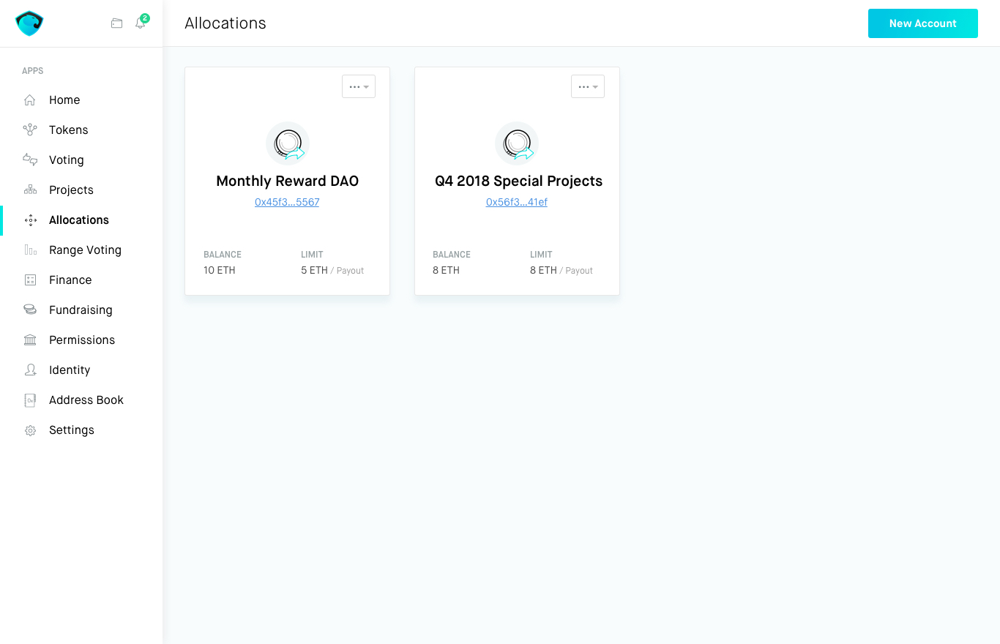
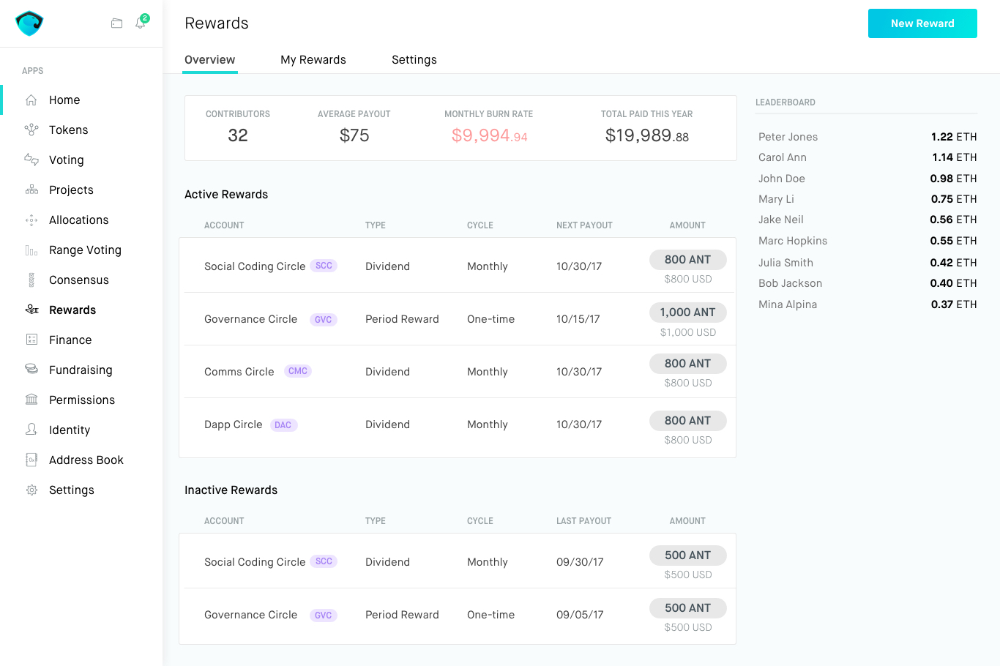

# That Planning Suite

[](https://travis-ci.org/spacedecentral/planning-suite) [](https://coveralls.io/github/spacedecentral/planning-suite)

<p align="center">
  <a href="#development-setup">Development Setup</a> •
  <a href="#background">Background</a> •
  <a href="#details">Details</a> •
  <a href="#design-concepts">Design Concepts</a>
  <a href="#contact">Contact</a>
</p>

## Development Setup

Node.js LTS or greater required.

- Note: @aragon/cli and truffle npm deps are automatically installed when bootstrapping.

```bash
# Bootstrap project dependencies:
$ npm i

# Start a local blockchain and deploy
# aragon dao kit with all apps:
$ npm start

# Develop single app react frontend:
$ npm run dev:projects

# Develop single app with backend and aragon wrapper:
$ npm run start:range

# current app name aliases: {address, projects, payout, range}
```

#### Extra tips:

- Individual development is ultra-fast thanks to parcel and hot module replacement.
- Start the dao kit to manage smart contracts interactions between all "planning apps" and aragon official apps (token manager and voting right now)
- The start script spawns a local blockchain, needed to publish the apps before deploying the dao kit template with all them.

**Detailed information in the [DEVELOPMENT_NOTES.md](/docs/DEVELOPMENT_NOTES.md) document.**

## Background

The proposal for an Aragon [Planning Suite](https://github.com/aragon/nest/pull/24) was developed by members of [Space Decentral](https://spacedecentral.net) and [Giveth](https://giveth.io), and received funding via [Aragon's Nest program](https://blog.aragon.one/introducing-aragon-nest-1aa8c91c0566): an example of decentralization at it's finest. We are developing this app as a collaborative unit because it is a crucial building block for any organization that aims to coordinate work and streamline management duties, without traditional managers. This app will work with any ERC-20 token or Aragon DAO.

## The Suite

The Planning Suite is a collection of six Aragon Apps that supports the following:

- **Allocations:** Propose new multi-party financial allocations, which are forwarded to the Range Voting app.
  - **Dynamic Payout:** Payroll contract that allows for dynamic allocations that are determined using range voting.
  - **Payout Engine:** Pay sharing contract using a percentage-based distribution system, where the percentages are determined using range voting.
- **Address Book:** Maintain a list of Ethereum addresses (external contacts/collaborators) mapped to human-readable names.
  - **Fixed Payout:** The address book will enable a more user-friendly way to access common addresses a DAO uses, making it easier to setup Fixed Payouts in various Aragon apps.
- **Range Voting:** Vote on the percentage of an allocation that distinct tasks, projects, or people should receive. Unique forwarding pattern allows for data to be added to EVM scripts within Aragon.
- **Projects:** Allow Github issues to be collectively prioritized in addition to applying bulk bounties.
  - **Github Integration:** Before we can utilize the decentralized git tool, it would be ideal to have an integration with a Github-based bounty system to provide immediate utility to Aragon DAOs.
  - **Issue Curation:** In the Planning app, token holders or project members will be able to curate / prioritize the top issues that should be developed.
  - **Bulk Bounties:** Allow bounties to be allocated to issues in a bulk-fashion.
    - **Off-Chain Estimates:** The bounty estimates are determined off-chain or are input by a single party, yet require an approval vote from the DAO (Forwards to Voting app)
    - **On-Chain Estimates:** Consensus or range voting contract is utilized for members to collectively estimate the value of task bounties. (Forwards to Consensus app).
- **Consensus:** Allow for special voting sessions to be created, where the aim is to reach consensus among the voting session participants.
- **Rewards:** Distributes payments to token holders based on the number of tokens one has earned in a specific cycle of time (one-time reward) or based on the total tokens one holds (dividend).

#### Please review the [White Paper](http://goo.gl/eXAybm) for full details.

## Design Concepts

These are some initial concepts. We expect to refine them and gather community feedback once approved.

#### Projects App


#### Allocations App



#### Rewards App



#### Issue Curation using Range Voting


### Flow Diagram

#### Financial Planning Toolkit

Hypothetical flow diagram. The components should be "plug and play" to design a rewards system tailored to an organization's unique needs.


## Contact

We can generally be found in the [Aragon Planning riot room](https://riot.im/app/#/room/#aragon-planning:matrix.org)

You may also reach out to us via email at: nest@space.coop

If you have any questions or want to get involved in our development please let us know!

## Special Thanks

Special thanks go to the Aragon team for much of the work this project is based on, as well as for allocating us this grant to build the tools we need to DAOify open source developemt!
